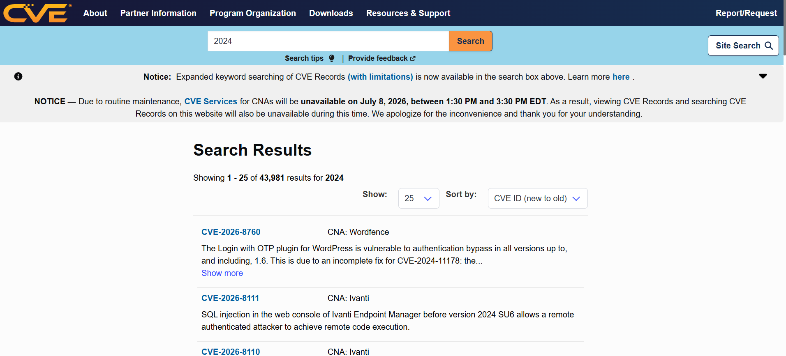

# Lab 3: Becoming a Network Defender

## 1. Laboratory Overview & Objectives

The objective of this laboratory is to research the industry certifications, specialized professional organizations, and technical 
threat intelligence frameworks required to build a career as a security analyst or ethical hacker. This module establishes a 
foundational roadmap for continuous professional growth and defensive operational readiness.

* **Host System:** Windows 11
* **Primary Focus:** Threat Intelligence, Vulnerability Databases, and Certification Pathways

---

## 2. Step-by-Step Task Execution & Evidence

### Part 1: Analyzing Professional Cybersecurity Tracks

1. Investigated entry-level and intermediate career paths tailored for Security Operations Center (SOC) environments.

2. Explored core technical requirements, focusing on the knowledge domains specified by the Cisco Certified Support Technician (CCST) Cybersecurity and CyberOps Associate tracks.

> **📸 Verification Screenshot 1: Cybersecurity Certification Mapping**
> 

### Part 2: Inspecting Vulnerability and Defense Frameworks
1. Navigated to open-source threat documentation databases to study how newly discovered security flaws are logged, assigned, and categorized by modern defenders.
2. Evaluated how security tracking numbers (CVE entries) and exploit code repositories are audited to maintain proactive defense patches.

> **📸 Verification Screenshot 2: Vulnerability Database Audit**
> 

---

## 3. Lab Questions & Technical Analysis

**Question 1: Why is continuous industry certification and research essential for a cybersecurity professional compared to other technology fields?**

* **Answer:** Threat actors and malicious methodologies evolve rapidly. Vulnerabilities are discovered daily, and attack vectors change to bypass new defensive tools. Continuous research and structured certifications ensure an analyst is equipped with up-to-date knowledge to counter modern tactics, techniques, and procedures (TTPs).

**Question 2: What is a CVE (Common Vulnerabilities and Exposures) identifier, and how does a network defender use it practically?**

* **Answer:** A CVE is a standardized identifier assigned to specific publicly known information security vulnerabilities. Defenders use CVE identifiers to quickly look up accurate, vendor-neutral descriptions of a security flaw. This allows them to assess if their local systems are vulnerable, match patches correctly, and configure firewalls or intrusion detection signatures to block precise exploits.

---

## 4. Laboratory Reflection

This module shifted focus from active command-line testing to structural industry frameworks. Understanding where threat intel is recorded (like CVE databases) and tracking established educational objectives (like CyberOps blueprints) bridges the gap between raw commands and strategic defensive management. Keeping tabs on open vulnerability records allows me to accurately contextualize what I witness later during deep-dive packet captures.

