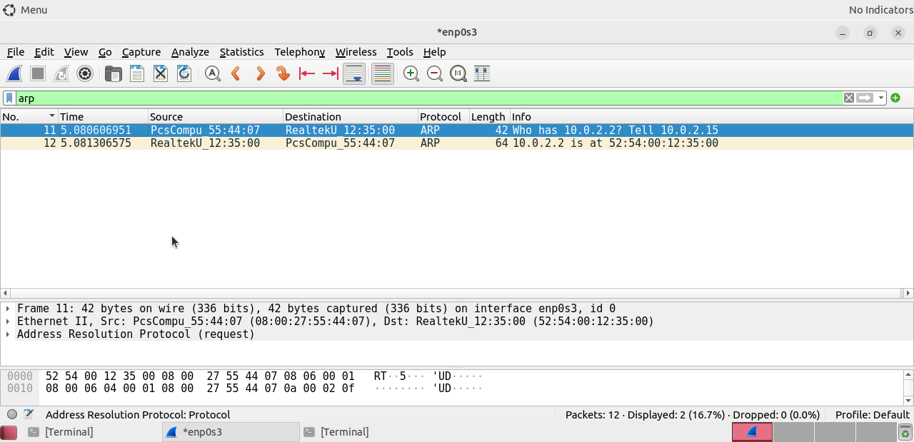
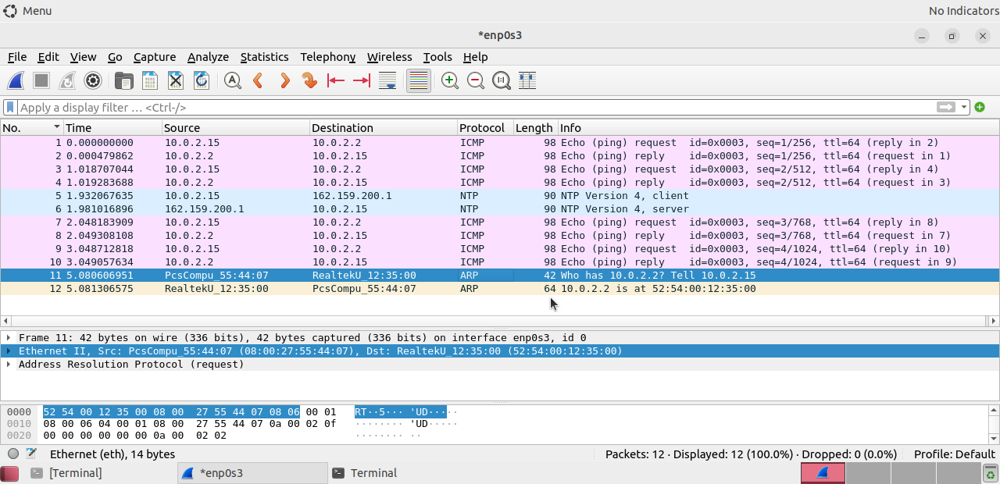

# Lab 4: Using Wireshark to Examine Ethernet Frames

## 1. Laboratory Overview & Objectives

The objective of this laboratory exercise is to analyze Layer 2 Ethernet II frames using the Wireshark packet analyzer framework. By isolating local network traffic captures, this module explores the specific structural fields of an Ethernet frame—including physical MAC addressing and protocol type flags—while observing the operational behavior of the Address Resolution Protocol (ARP).

* **Host System:** Windows 11
* **Guest System:** Arch Linux (CyberOps Workstation)
* **Captured Interface:** `enp0s3`
* **Primary Tools:** Wireshark Packet Analyzer, Terminal Engine

---

## 2. Step-by-Step Task Execution & Evidence

### Part 1: Initializing the Capture Interface & Filtering ARP Broadcasts

1. Launched Wireshark within the graphical user desktop of the CyberOps Workstation.
2. Initiated a live traffic capture on the active interface `enp0s3`.
3. Executed local ping commands to trigger address resolution queries, then applied the display filter `arp` to isolate ARP request and reply frames.
4. Frame 11 records an ARP request from `10.0.2.15` (`08:00:27:55:44:07`) querying `"Who has 10.0.2.2? Tell 10.0.2.15"`.
5. Frame 12 records the unicast ARP response indicating `10.0.2.2 is at 52:54:00:12:35:00`.

> **📸 Verification Screenshot 1: Isolated ARP Traffic Stream**
> 

---

### Part 2: Dissecting the Structure of an Ethernet II Frame

1. Selected Frame 11 from the capture list panel to inspect its protocol stack.
2. Expanded the Layer 2 header metadata under the "Ethernet II" details window to inspect physical hardware addresses and EtherType indicators.

#### Captured Network Parameters Table

| Parameter | Observed Value |
| :--- | :--- |
| **Source Host IP** | `10.0.2.15` |
| **Source Host MAC** | `08:00:27:55:44:07` (`PcsCompu_55:44:07`) |
| **Target Gateway IP** | `10.0.2.2` |
| **Target Gateway MAC** | `52:54:00:12:35:00` (`RealtekU_12:35:00`) |
| **EtherType Flag** | `0x0806` (Address Resolution Protocol) |

> **📸 Verification Screenshot 2: Ethernet II Header Field Expansion**
> 

---

## 3. Lab Questions & Technical Analysis

**Question 1: What is the purpose of the 'Type' field inside an Ethernet II frame header, and what are two common hex values found there?**

* **Answer:** The Type field (2 bytes) specifies which upper-layer protocol is encapsulated inside the frame's payload data area, telling the receiving network interface card exactly how to parse the incoming frame. Two highly common hex values are `0x0800` (which designates an IPv4 packet) and `0x0806` (which designates an Address Resolution Protocol frame, as observed in Frame 11).

**Question 2: What unique destination MAC address is used during an initial ARP request when a device does not yet know the destination's physical hardware address?**

* **Answer:** An initial ARP request utilizes a Layer 2 broadcast address consisting entirely of binary 1s, which is represented in hexadecimal as `ff:ff:ff:ff:ff:ff`. This ensures that every network node connected to the local broadcast domain receives and evaluates the query to see if it owns the target IP address.

---

## 4. Laboratory Reflection

This laboratory offered excellent clarity on how Layer 2 addressing functions beneath the IP layer. Observing an ARP request query originating from `10.0.2.15` transform dynamically into a targeted unicast reply from `10.0.2.2` (`52:54:00:12:35:00`) showed exactly how devices construct local hardware tables. Verifying the MAC mapping structures and EtherType indicators (`0x0806`) bridged theoretical knowledge directly with live packet inspection.