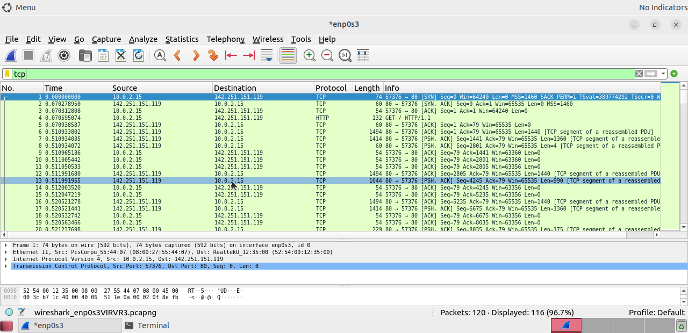
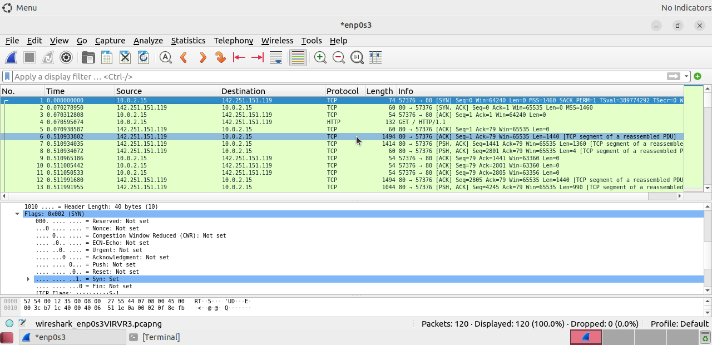

# Lab 5: Using Wireshark to Observe the TCP 3-Way Handshake

## 1. Laboratory Overview & Objectives
The objective of this laboratory exercise is to analyze Layer 4 transport behaviors by isolating Transmission Control Protocol (TCP) connection initialization sequences. Using Wireshark, this module maps the structural mechanics of the connection-oriented TCP 3-way handshake, verifying how sequence values and control flags govern reliability.

* **Host System:** Windows 11 
* **Guest System:** Arch Linux (CyberOps Workstation)
* **Primary Tools:** Wireshark Packet Analyzer, Terminal Network Tools

---

## 2. Step-by-Step Task Execution & Evidence

### Part 1: Capturing the TCP Connection Establishment
1. Initiated a live tracking session inside Wireshark on the primary interface (`enp0s3`).
2. Generated outbound network socket connections from the console terminal, then isolated the transport streams using the `tcp` display filter to find the initialization point.

> **📸 Verification Screenshot 1: Isolated TCP [SYN], [SYN-ACK], [ACK] Stream**
> 

### Part 2: Analyzing the TCP Control Flags Header
1. Selected the initial connection request packet (`SYN`) from the sequence window to evaluate transmission overhead properties.
2. Expanded the Layer 4 Transmission Control Protocol segment data block, focusing on the bitmask breakdown within the control registers to confirm flag settings.

> **📸 Verification Screenshot 2: TCP Flag Bitmask Analysis**
> 


### Part 3: Inspecting Connection Traces using the Terminal Interface (`tcpdump`)
1. Closed the graphical user interface components of Wireshark.
2. Executed terminal inspection profiles using the lightweight `tcpdump` packet analyzer tool.
3. Utilized file reading parameters to display structural layer content from saved capture logs directly onto the system console shell interface.

```bash
# Reading the handshake trace data cleanly inside the terminal console interface
sudo tcpdump -r /home/analyst/capture.pcap -n | head -n 3


---

## 3. Lab Questions & Technical Analysis

# TCP/IP Networking & Wireshark Analysis Q&A Reference Guide

---

### Question 1: Packet Identification & Roles in Connection Establishment
**What are the exact names and roles of the three packets involved in a standard TCP connection establishment?**

#### Answer:
1. **SYN (Synchronize):** Sent by the initiating client to propose a connection baseline and synchronize initial sequence numbers ($ISN$).
2. **SYN-ACK (Synchronize-Acknowledgment):** Sent by the target server to acknowledge the client's request while transmitting its own independent sequence parameter counter.
3. **ACK (Acknowledge):** Sent by the client to finalize connection establishment parameters, verifying receipt of the server's sequence parameters.

---

### Question 2: Port Identification & Classification
**What is the initial TCP source port number, and how would you classify it? What is the destination port number, and how is it classified?**

#### Answer:
* **Source Port:** A high-numbered port randomly chosen from the range 49152–65535, classifying it as an **Ephemeral (Dynamic or Private) port** assigned dynamically by the host OS.
* **Destination Port:** **Port 80**, which is classified as a **Well-Known (Registered) port** reserved globally for HTTP web service traffic.

---

### Question 3: Handshake Sequence Analysis (Frame 2)
**In Frame 2 (the SYN-ACK reply), what happens to the source and destination port values? Which flags are enabled, and what are the relative sequence and acknowledgment numbers?**

#### Answer:
* **Port Orientation:** The source and destination port values invert completely: the source port becomes 80 and the destination port matches the client's dynamic ephemeral port number.
* **Flags:** The **SYN** and **ACK** flags are explicitly set to `1` inside the flag bitmask.
* **Tracking Numbers:** The relative sequence number is set to `0`, and the relative acknowledgment number is set to `1`.

---

### Question 4: Handshake Sequence Analysis (Frame 3)
**In Frame 3 (the concluding ACK), which flag is set, and what are the relative sequence and acknowledgment numbers?**

#### Answer:
* **Flags:** Only the **ACK** (Acknowledgment) flag is set to `1`.
* **Tracking Numbers:** Both the relative sequence number and relative acknowledgment number are incremented to `1`.

---

### Question 5: Relative vs. Raw Sequence Numbers
**Why do relative Sequence Numbers start at 0 in Wireshark, whereas the actual raw Sequence Numbers are large, random 32-bit integers?**

#### Answer:
Wireshark automatically translates raw, random 32-bit Initial Sequence Numbers ($ISNs$) to a relative baseline of `0` at the beginning of a trace session to simplify data analysis for humans. 

Raw sequence numbers are securely randomized by modern operating systems to prevent **blind TCP sequence prediction attacks**, where an attacker guesses tracking fields to hijack active connections.

---

### Question 6: Handshake Mathematical Relationships
**What is the relationship between the Sequence Number ($Seq$) of the initial client SYN packet and the Acknowledgment Number ($Ack$) returned in the server's SYN-ACK packet?**

#### Answer:
The server's Acknowledgment Number is exactly equal to the client's Initial Sequence Number plus 1 ($ISN_{client} + 1$). 

Even though the client's SYN packet contains no physical payload data bytes, the active SYN flag consumes exactly `1` logical sequence value, requiring the server to acknowledge it by incrementing the tracking counter before data transport begins.

---

### Question 7: Flow Control Mechanisms
**What is the significance of the Window Size parameter exchanged during the 3-way handshake?**

#### Answer:
The Window Size field advertises the maximum volume of bytes a host is willing and able to handle in its local memory buffer before requiring an acknowledgment response. This implements dynamic **TCP Flow Control** to ensure a fast sender does not overwhelm a slow recipient.

---

### Question 8: Maximum Segment Size Optimization
**What is the purpose of the MSS (Maximum Segment Size) option field seen within the options block of the SYN packet header?**

#### Answer:
The Maximum Segment Size ($MSS$) dictates the absolute largest payload block of unfragmented Layer 4 data a device can process in a single packet. It optimizes transmission by ensuring total packet sizes remain within local hardware boundaries (such as a standard 1500-byte Ethernet Maximum Transmission Unit minus structural IP/TCP packet headers).

---

### Question 9: Connection Rejection & Error Handling
**If a port on a remote server is closed or unavailable when a client sends a SYN packet, what TCP flag combination does the server send back instead of a SYN-ACK?**

#### Answer:
If the destination port is closed or unmonitored, the server rejects the initialization attempt by returning a packet with the **RST (Reset)** and **ACK (Acknowledgment)** flags enabled simultaneously (**RST-ACK**). This abruptly breaks off the handshake sequence and signals to the client that the application service is unavailable.

---

### Question 10: CLI Packet Capture Analysis
**What functionality does the `-r` switch provide when executing the `tcpdump` engine from a command-line prompt?**

#### Answer:
The `-r` flag instructs `tcpdump` to **read and parse** an existing saved packet capture file (like a `.pcap` or `.pcapng` file) rather than sniffing live traffic off an active hardware interface.

---

### Question 11: Network Administrator Display Filters
**There are hundreds of filters available in Wireshark. A large network could have numerous filters and many different types of traffic. List three filters that might be useful to a network administrator?**

#### Answer:
1. **`ip.addr == [IP_Address]` (or `ip.src` / `ip.dst`)**
   * *Use Case:* Narrows traffic down to/from a specific target host, filtering out network noise during localized server troubleshooting.
2. **`tcp.flags.reset == 1` or `tcp.flags.syn == 1 and not tcp.flags.ack == 1`**
   * *Use Case:* Targets connection failures (RST packets) or detects half-open connections associated with SYN-flood DDoS attacks or port scans.
3. **`http.response.code >= 400` or `dns.flags.rcode != 0`**
   * *Use Case:* Isolates application and infrastructure errors, identifying broken web responses or failed domain-name resolutions (NXDOMAIN).

---

### Question 12: Production Network Use Cases
**What other ways could Wireshark be used in a production network?**

#### Answer:
* **Security & Incident Response (Forensics):** Examining PCAPs to detect malware command-and-control (C2) beaconing, investigating data exfiltration, and verifying that critical protocols use TLS/SSL encryption rather than plain cleartext.
* **Performance Benchmarking:** Establishing network performance baselines (latency, RTT) during peak hours to compare against later system degradations and pinpoint bandwidth-hogging endpoints.
* **Network Application Debugging:** Resolving network vs. application layer latency bottlenecks, and auditing corporate VoIP streams (SIP/RTP) to fix jitter, packet loss, or call drops.
* **Regulatory Compliance Auditing:** Delivering forensic packet logs to auditors as cryptographic validation that sensitive environments (like PCI-DSS cardholder environments) are fully isolated from unauthorized traffic.


---

## 4. Laboratory Reflection
This laboratory successfully proved the mechanics of connection management over unreliable mediums. Observing the actual sequence values move from relative zeroing baselines to incremented flags exposed the programmatic tracking that keeps web data from arriving corrupted or dropped. This foundational baseline directly equips me to distinguish typical application negotiations from malicious port scanning methodologies.
