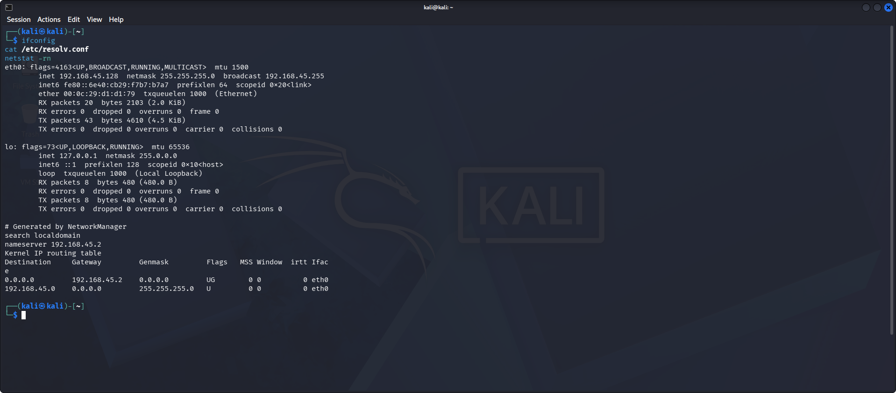
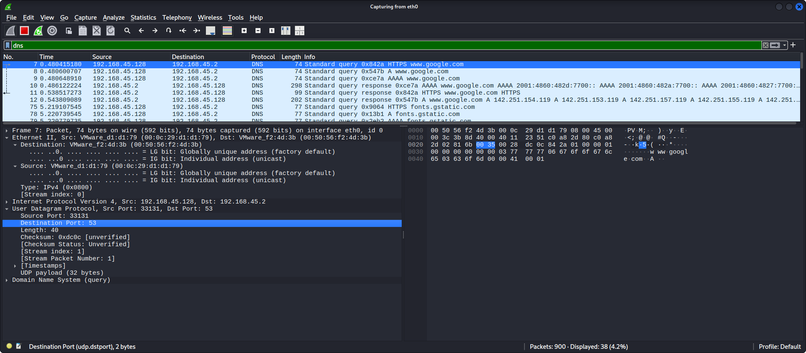
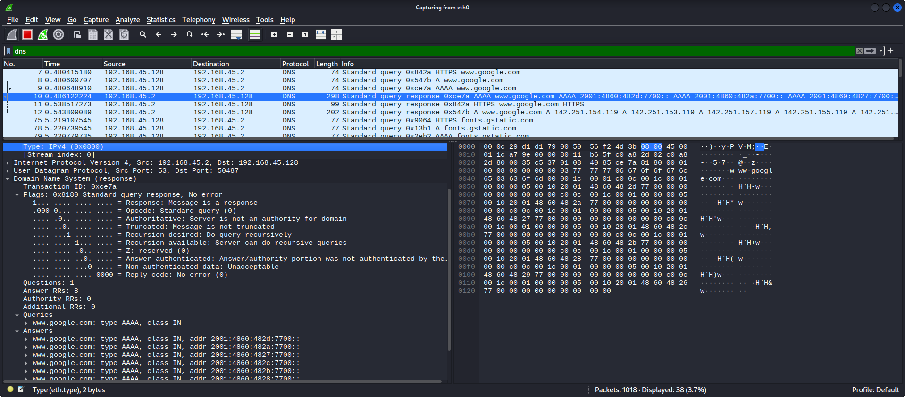

# Lab 6: Using Wireshark to Examine a UDP DNS Capture

## 1. Laboratory Overview & Objectives

The objective of this laboratory is to analyze the mechanics of the Domain Name System (DNS) and the User Datagram Protocol (UDP) transport layer using Wireshark. By capturing active DNS queries and responses generated during host lookups, this lab examines packet encapsulation, header fields, dynamic port assignment, and DNS response structures.

* **Host System:** Windows 11
* **Guest System:** CyberOps Workstation (Arch Linux)
* **Captured Interface:** `eth0`
* **Primary Tools:** `ifconfig`, `cat /etc/resolv.conf`, `netstat`, `wireshark`

---

## 2. Step-by-Step Task Execution & Evidence

### Part 1: IP Configuration & Environment Verification

1. Booted the Workstation VM and verified active network interfaces.
2. Executed `ifconfig` in the terminal to identify the active IPv4 address and MAC bindings on `eth0`.
3. Examined `/etc/resolv.conf` to identify configured local resolver entries.
4. Generated the routing table using `netstat -rn` to identify the default gateway.

#### Network Configuration Summary Table

| Description | Settings / Addresses |
| :--- | :--- |
| **IP Address** | `192.168.45.128` |
| **MAC Address** | `00:0c:29:d1:d1:79` |
| **Default Gateway IP Address** | `192.168.45.2` |
| **DNS Server IP Address** | `192.168.45.2` |

> **📸 Verification Screenshot 1: Network Interface & Resolver Setup**
> 

---

### Part 2: Capturing DNS Exchanges via Wireshark

1. Launched Wireshark from the terminal (`wireshark &`) and initiated packet capture on interface `eth0`.
2. Opened a web browser and navigated to `www.google.com` to generate DNS lookup queries.
3. Stopped the packet capture once domain resolution traffic was recorded.
4. Applied the display filter `dns` to isolate query and response frames.

---

## 3. Detailed Packet Header Analysis

### Step 1: DNS Query Packet Breakdown (Frame 7)

> **📸 Verification Screenshot 2: Wireshark DNS Query Analysis**
> 

#### Hardware and Layer 3 Addressing

| Device Role | IP Address | MAC Address |
| :--- | :--- | :--- |
| **Source Workstation** | `192.168.45.128` | `00:0c:29:d1:d1:79` (`VMware_d1:d1:79`) |
| **Destination DNS Server** | `192.168.45.2` | `00:50:56:f2:4d:3b` (`VMware_f2:4d:3b`) |

* **Is the source MAC address the same as recorded in Part 1?**  
  **Yes.** The source MAC address (`00:0c:29:d1:d1:79`) matches the physical Ethernet adapter interface (`eth0`) of the CyberOps Workstation VM.

#### Layer 4 UDP Query Header Fields

* **Source Port:** `33131` (Dynamically assigned high-numbered ephemeral port)
* **Destination Port:** `53` (Well-known port reserved for DNS services)
* **UDP Length:** `40` bytes (8 bytes UDP header + 32 bytes UDP payload)
* **Checksum:** `0xdc0c` [unverified]
* **Query Payload:** Standard query `0x842a` HTTPS `www.google.com`

---

### Step 2: DNS Response Packet Breakdown (Frame 10 & 12)

> **📸 Verification Screenshot 3: Wireshark DNS Response Analysis**
> 

#### Addressing Shifts in Response Traffic

* **In the Ethernet II frame for the DNS response, what device is the source MAC and destination MAC?**  
  * **Source MAC:** `00:50:56:f2:4d:3b` (Gateway / DNS Resolver interface)
  * **Destination MAC:** `00:0c:29:d1:d1:79` (Workstation VM interface)

* **What is the source and destination IP address?**  
  * **Source IP Address:** `192.168.45.2` (DNS Server)
  * **Destination IP Address:** `192.168.45.128` (Workstation VM)

* **What happened to the roles of source and destination for the VM and default gateway?**  
  **The roles completely reversed.** The original destination (`192.168.45.2:53`) became the source transmitting the response payload, and the original requesting client (`192.168.45.128`) became the destination.

#### Layer 4 UDP Response Header Fields & Resolved Payload

* **Source Port:** `53` (DNS Server process)
* **Destination Port:** `50487` / `33131` (Ephemeral client port opened by VM)
* **Transaction ID:** `0xdce7a`
* **Resolved IP Addresses (Answers Payload):**
  * **IPv6 Records (AAAA):** `2001:4860:482d:7700::`, `2001:4860:482a:7700::`, `2001:4860:4827:7700::`
  * **IPv4 Records (A):** `142.251.154.119`, `142.251.153.119`, `142.251.157.119`, `142.251.155.119`

---

## 4. Laboratory Questions & Reflection

**Question: What are the benefits of using UDP instead of TCP as a transport protocol for DNS?**

* **Answer:**  
  1. **Low Overhead & Speed:** UDP headers are significantly smaller (8 bytes) compared to standard TCP headers (20 bytes minimum). Because standard DNS query and reply payloads easily fit inside a single packet frame, UDP minimizes bandwidth and latency.
  2. **No Connection Handshake:** UDP eliminates the multi-step TCP 3-way handshake (`SYN`, `SYN-ACK`, `ACK`), allowing host resolution queries to resolve instantly.
  3. **Server Scalability:** Recursive DNS servers handling tens of thousands of requests per second avoid having to track active connection state tables, conserving CPU and memory resources.