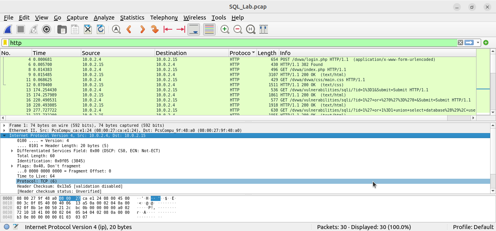
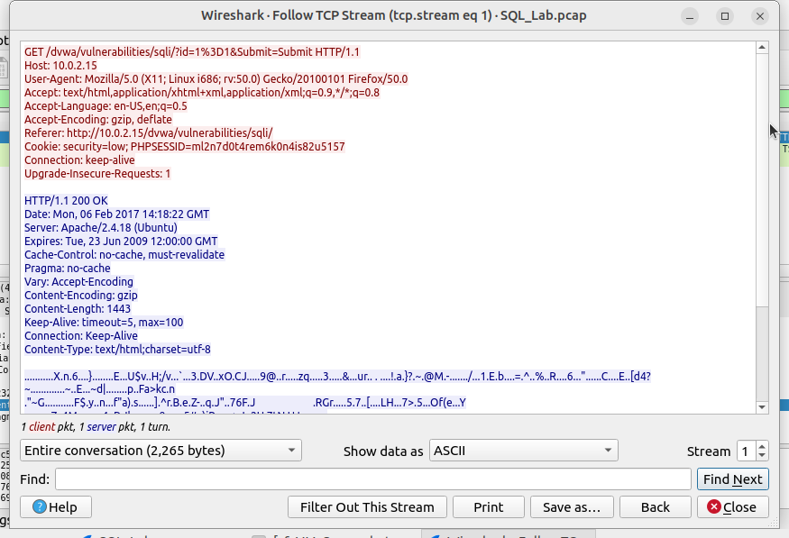

# Lab 7: Extracting Information from a Packet Capture

## 1. Laboratory Overview & Objectives

The objective of this laboratory is to analyze pre-recorded packet capture (`.pcap`) files using Wireshark to extract application-layer data, analyze TCP stream sessions, and inspect unencrypted network artifacts. By reconstructing captured network traffic, this lab demonstrates how network analysts inspect file transfers, HTTP requests, and payload content.

* **Host System:** Windows 11
* **Guest System:** Arch Linux (CyberOps Workstation)
* **Captured File:** `SQL_Lab.pcap`
* **Primary Tools:** Wireshark Packet Analyzer

---

## 2. Step-by-Step Task Execution & Evidence

### Part 1: Loading and Filtering Packet Captures

1. Launched Wireshark and loaded the capture file `SQL_Lab.pcap`.
2. Applied the display filter `http` to isolate web traffic queries and server responses.
3. Inspected captured frames generated against the DVWA web application (`10.0.2.15`), revealing incoming SQL injection test vectors.

#### Captured Traffic Parameter Table

| Parameter | Observed Value |
| :--- | :--- |
| **Source Client IP** | `10.0.2.4` |
| **Target Web Server IP** | `10.0.2.15` |
| **Application Protocol** | `HTTP/1.1` |
| **Target Application Path** | `/dvwa/vulnerabilities/sqli/` |

> **📸 Verification Screenshot 1: PCAP Stream & Applied Display Filter**
> 

---

### Part 2: Following TCP Streams & Reconstructing Data

1. Right-clicked an active packet within the target conversation (Frame 13) and selected **Follow -> TCP Stream**.
2. Analyzed the raw reassembled payload across `tcp.stream eq 1` (2,265 total bytes).
3. Inspected clear-text client HTTP GET headers (`User-Agent`, `Cookie`, `Referer`) alongside the returning server response (`HTTP/1.1 200 OK`, `Server: Apache/2.4.18`).

> **📸 Verification Screenshot 2: TCP Stream Reassembly & Payload Analysis**
> 

---

## 3. Lab Questions & Technical Analysis

**Question 1: What are the security risks associated with inspecting unencrypted HTTP traffic in a packet capture?**

* **Answer:** Unencrypted traffic (such as HTTP or FTP) transmits payloads in plain text. Any attacker or analyst with access to the packet capture can read sensitive information directly—including user credentials, session cookies (`PHPSESSID`), GET parameters, and transferred files—without needing to decrypt the traffic.

**Question 2: How does Wireshark's "Follow TCP Stream" feature assist a security analyst during an investigation?**

* **Answer:** "Follow TCP Stream" reconstructs the raw, unencrypted conversation between the client and server in chronological order. Instead of forcing the analyst to inspect individual packet frames one by one, it aggregates the Layer 7 application data into a single readable window, making it easy to analyze full HTTP requests, responses, or malicious command payloads.

---

## 4. Laboratory Reflection

This laboratory demonstrated the practical mechanics of analyzing captured network traffic to reconstruct host activity. By navigating through TCP streams and applying display filters to `SQL_Lab.pcap`, key operational data and session parameters were successfully isolated from background noise. These techniques highlight both the diagnostic power of Wireshark for security analysts and the critical necessity of encrypting sensitive communications using protocols like HTTPS and TLS.