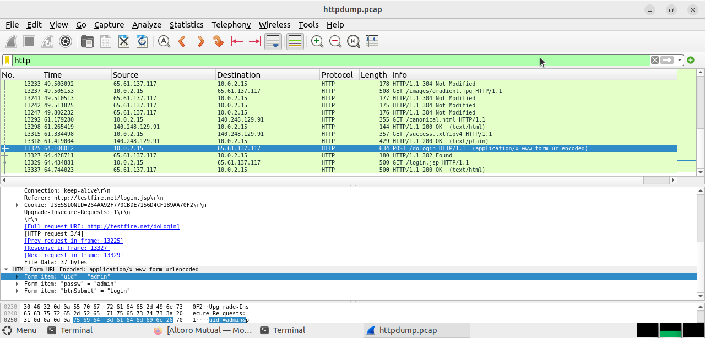
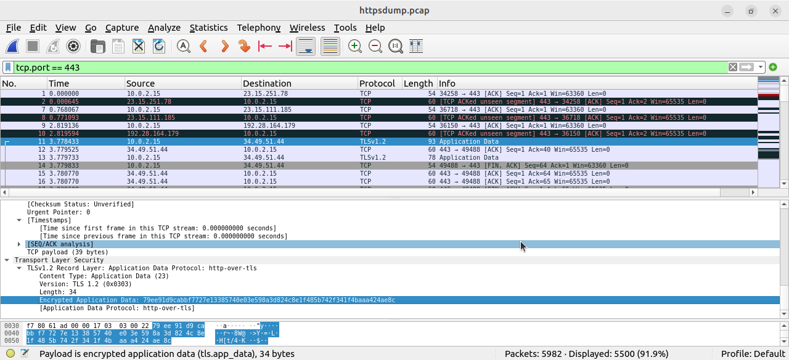

# Lab 08: Using Wireshark to Examine HTTP and HTTPS Traffic

## 1. Executive Summary & Lab Information

This laboratory module focuses on analyzing the structural and security differences between unencrypted Hypertext Transfer Protocol (HTTP) traffic and encrypted Hypertext Transfer Protocol Secure (HTTPS) traffic. Using command-line utilities (`tcpdump`) and graphical packet analyzers (Wireshark), network traffic is inspected to demonstrate how HTTP exposes sensitive credentials in plaintext while HTTPS enforces encryption via SSL/TLS.

### Lab Information

| Item | Details |
|---|---|
| **Student Name** | Dilan Imalka Ranasinghe |
| **Registration Number** | GP/26/K72T002P5.0/1/0003 |
| **Host Operating System** | Windows 11 |
| **Guest Virtual Machine** | Arch Linux (CyberOps Workstation VM) |
| **Target Network Interface** | `enp0s3` |
| **Analysis Tools Used** | `tcpdump`, Wireshark, Mozilla Firefox Browser |

---

## 2. Environment Verification & Preliminary Commands

Before initiating packet captures, the workstation interfaces were identified and verified using the command line:

```bash
[analyst@secOps ~]$ ip address
1: lo: <LOOPBACK,UP,LOWER_UP> mtu 65536 qdisc noqueue state UNKNOWN group default qlen 1000
    link/loopback 00:00:00:00:00:00 brd 00:00:00:00:00:00
    inet 127.0.0.1/8 scope host lo
       valid_lft forever preferred_lft forever
    inet6 ::1/128 scope host

2: enp0s3: <BROADCAST,MULTICAST,UP,LOWER_UP> mtu 1500 qdisc fq_codel state UP group default qlen 1000
    link/ether 08:00:27:55:44:07 brd ff:ff:ff:ff:ff:ff
    inet 10.0.2.15/24 metric 100 brd 10.0.2.255 scope global dynamic enp0s3
       valid_lft 82091sec preferred_lft 82091sec
    inet6 fd17:625c:f037:2:a00:27ff:fe55:4407/64 scope global dynamic mngtmpaddr noprefixroute
       valid_lft 86399sec preferred_lft 14399sec
    inet6 fe80::a00:27ff:fe55:4407/64 scope link
       valid_lft forever preferred_lft forever
```

### Active Network Interfaces Summary

| Interface | Type | IPv4 Address / Subnet | IPv6 Address | State | MAC Address |
|---|---|---|---|---|---|
| `lo` | Virtual Loopback | `127.0.0.1/8` | `::1/128` | UNKNOWN | `00:00:00:00:00:00` |
| `enp0s3` | Ethernet Connection | `10.0.2.15/24` | `fd17:625c:f037:2:a00:27ff:fe55:4407/64` | UP | `08:00:27:55:44:07` |

---

## 3. Step-by-Step Task Execution

### Part 1: Capturing and Inspecting Unencrypted HTTP Traffic

#### Step 1: Start Packet Capture

Opened the terminal on the CyberOps Workstation and executed `tcpdump` to write captured packets to `httpdump.pcap`:

```bash
sudo tcpdump -i enp0s3 -s 0 -w httpdump.pcap
```

#### Step 2: Access the HTTP Portal

Opened Mozilla Firefox and accessed the unencrypted portal:

```text
http://www.altoromutual.com/login.jsp
```

Entered the authentication parameters into the login prompt:

- **Username:** `Admin`
- **Password:** `Admin`

Submitted the login form.

#### Step 3: Stop the Capture and Open It in Wireshark

Stopped `tcpdump` using `CTRL+C` and launched the capture file in Wireshark:

```bash
wireshark httpdump.pcap &
```

Applied the following Wireshark display filter:

```text
http
```

The authentication frame containing the `POST /doLogin` request was then isolated.

### HTTP Parameter Breakdown

| Protocol Parameter | Value Captured in Payload | Security Implications |
|---|---|---|
| **Request Method** | `POST` | Transmits payload data inside the frame body. |
| **Header Type** | `application/x-www-form-urlencoded` | Transmits form keys and values without encryption. |
| **Username (`uid`)** | `Admin` | Fully visible in cleartext to network eavesdroppers. |
| **Password (`passw`)** | `Admin` | Fully visible in cleartext to network eavesdroppers. |

**📸 Verification Asset 1:** 

---

### Part 2: Capturing and Inspecting Encrypted HTTPS Traffic

#### Step 1: Start HTTPS Packet Capture

Re-initiated command-line packet capture targeting HTTPS sessions:

```bash
sudo tcpdump -i enp0s3 -s 0 -w httpsdump.pcap
```

#### Step 2: Access the HTTPS Service

Opened Firefox and navigated to the encrypted web service:

```text
https://www.netacad.com
```

Clicked the login portal link and submitted test entries into the secure input fields.

#### Step 3: Stop the Capture and Open It in Wireshark

Terminated `tcpdump` and loaded `httpsdump.pcap` in Wireshark.

Applied the following display filter to isolate SSL/TLS traffic over port 443:

```text
tcp.port == 443
```

### HTTPS Parameter Breakdown

| Protocol Parameter | Value Captured in Payload | Security Implications |
|---|---|---|
| **Transport Protocol** | TCP (Port 443) | Ensures reliable transport for cryptographic exchanges. |
| **Security Layer** | Transport Layer Security (TLSv1.2 / TLSv1.3) | Encrypts application payloads end-to-end. |
| **Content Type** | Application Data (23) | Transmits protected HTTP headers and form payloads. |
| **Payload Format** | Ciphertext / Hex Stream | Protects sensitive credentials from unauthorized extraction. |

**📸 Verification Asset 2:** 

---

## 4. Technical Analysis & Lab Questions

### Part 1, Step 2b: List the interfaces and their IP addresses displayed in the `ip address` output.

**Answer:**

- **`lo` (Loopback interface):** `127.0.0.1/8`
- **`enp0s3` (Ethernet interface):** `10.0.2.15/24`

---

### Part 1, Step 3d: Expand the HTML Form URL Encoded section. What two pieces of information are displayed?

**Answer:**

Expanding the **HTML Form URL Encoded** application tree displays the cleartext form submission parameters:

```text
uid: Admin
passw: Admin
```

This demonstrates that the HTTP login credentials are visible in cleartext.

---

### Part 2, Step 1b: What do you notice about the website URL?

**Answer:**

The address line begins with the `https://` protocol scheme and displays a closed padlock icon, indicating that the traffic is encrypted over an SSL/TLS session.

---

### Part 2, Step 2d: What has replaced the HTTP section that was in the previous capture file?

**Answer:**

The HTTP header structure is replaced by the **Transport Layer Security (TLS)** record layer, displaying encrypted **Application Data** payloads.

---

### Part 2, Step 2f: Is the application data in a plaintext or readable format?

**Answer:**

No. The application data is rendered as an unreadable hexadecimal stream (ciphertext). This prevents eavesdroppers from directly reading the transmitted data without the required encryption keys.

---

## 5. Analytical Reflections & Conclusions

### Advantages of Deploying HTTPS over HTTP

#### 5.1 Confidentiality

HTTPS encrypts session data to protect sensitive information such as:

- User credentials
- Financial transactions
- Session tokens

This prevents sensitive application data from being directly exposed through packet sniffing.

#### 5.2 Integrity

HTTPS uses cryptographic mechanisms to help verify that transmitted data has not been altered or tampered with during communication.

#### 5.3 Authentication

HTTPS uses Public Key Infrastructure (PKI) and digital certificates to help confirm the identity of the web server to client endpoints.

---

### Security Considerations Regarding HTTPS Trustworthiness

While HTTPS guarantees an encrypted communication channel, it does **not** by itself validate whether a website is safe or trustworthy.

Threat actors can obtain valid SSL/TLS certificates for phishing sites, typosquatting domains, or malicious hosting environments. Therefore, modern Security Operations Center (SOC) analysts should inspect additional indicators, including:

- Domain reputation
- Certificate information
- URL and domain characteristics
- Payload behavior
- Other available threat intelligence

HTTPS should therefore be viewed as a mechanism for **securing communication**, not as a guarantee that the destination itself is trustworthy.

---

## 6. Conclusion

This laboratory demonstrated the practical security differences between HTTP and HTTPS using `tcpdump` and Wireshark.

The HTTP capture demonstrated that form data, including the username and password, could be viewed directly in plaintext. In contrast, the HTTPS capture showed TLS-protected application data that was not directly readable as HTTP content.

The experiment demonstrates why HTTPS is essential for protecting sensitive information during network communication. It also highlights the important security principle that encryption alone does not establish the trustworthiness of a website.
